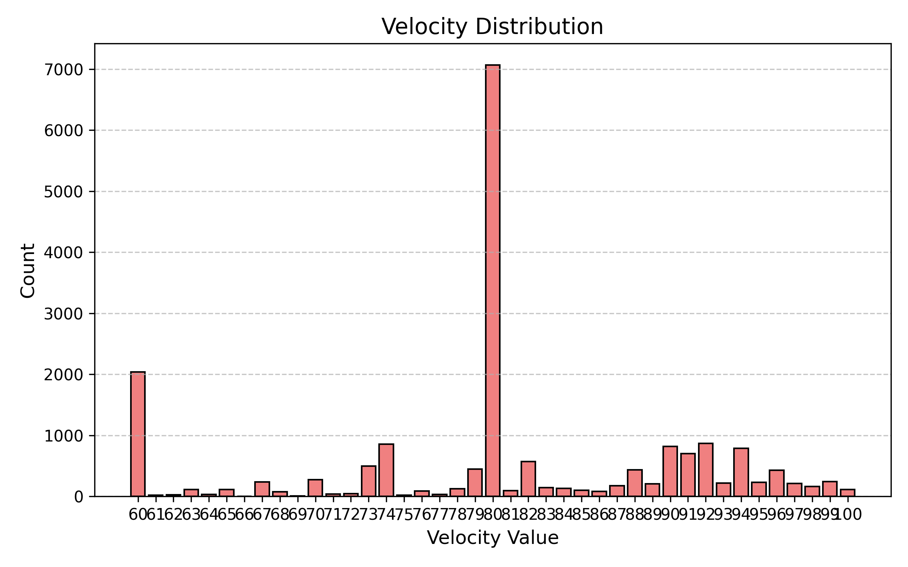
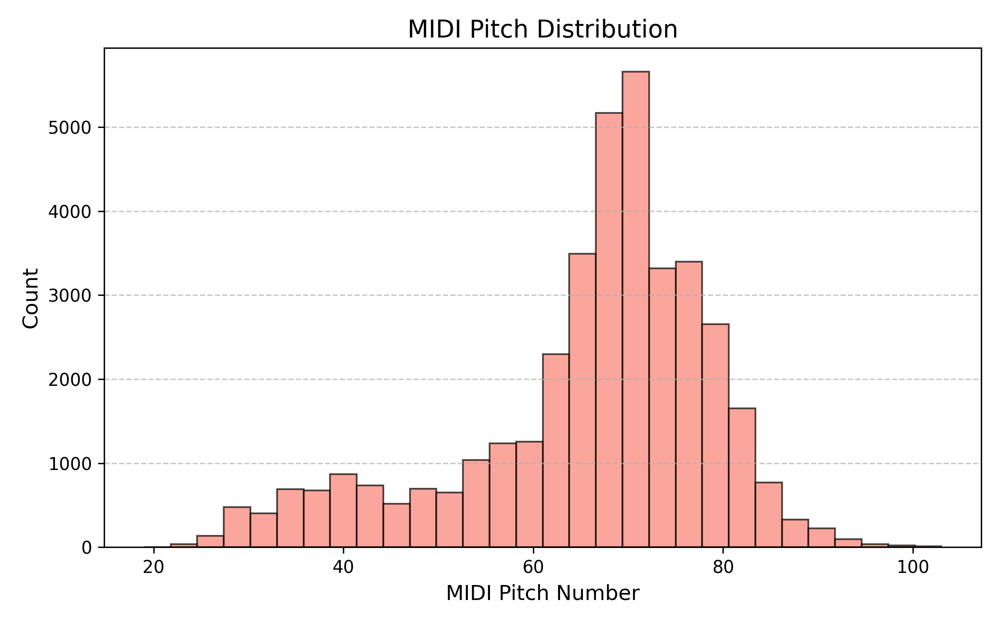
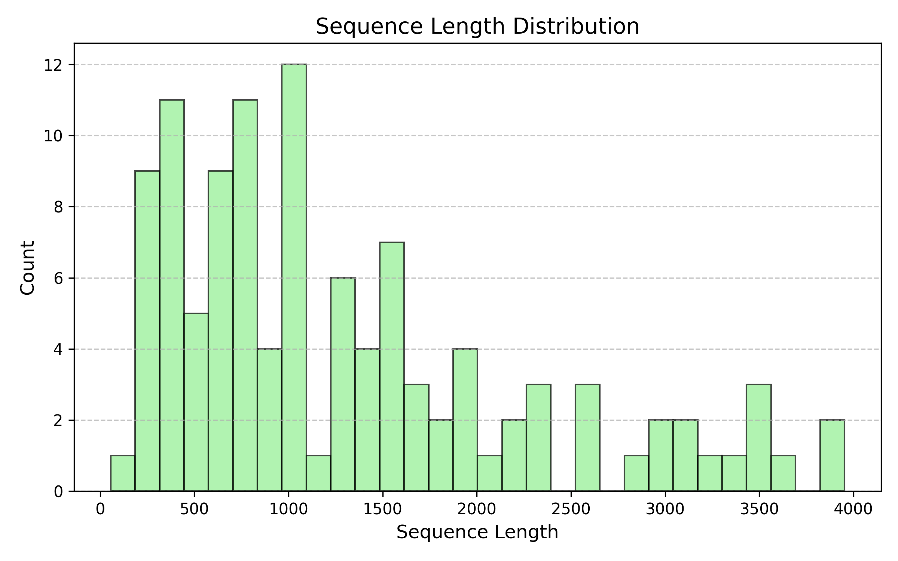
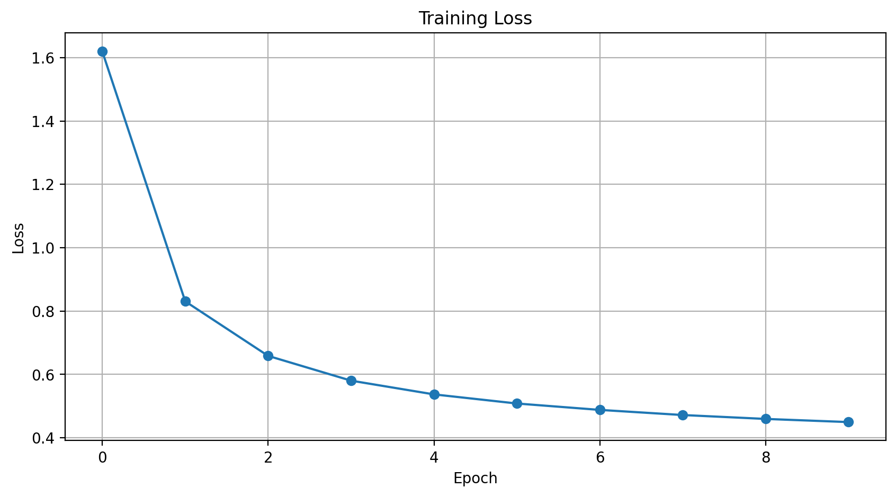
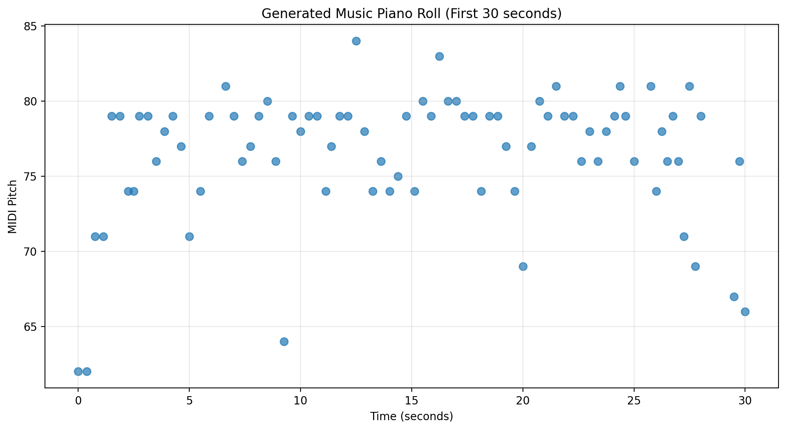

# Unconditional Symbolic Music Generation

This repository contains an **unconditional symbolic music generation model** trained on MIDI data. The goal is to learn patterns in note sequences and generate new musical compositions without conditioning on external metadata (e.g., genre, composer, mood). The workflow includes data preprocessing, model design, training, evaluation, and audio rendering.

---

Project Overview
The project focuses on building and training a deep learning model capable of generating symbolic music. Major components include:

### **1. Dataset & Preprocessing**
- Loaded a collection of 116 violin performance MIDI files.
- Extracted note-based sequences.
- Converted symbolic musical elements (pitch, duration, velocity) into a tokenized numerical format, resulting in a vocabulary size of 449 unique possible events. 
- Created fixed-length training sequences suitable for sequence models.

### **2. Model Architecture**
- Implemented a Long Short-Term Memory RNN in PyTorch which takes a sequence of events from our vocabulary as input.
    - 3 layers with 256 units per layer and a dropout probability of 0.3 to prevent overfitting. 
- Optimized the model for Cross-Entropy loss.
- Once the model was trained it was able to generate new event sequences from a short seed sequence, which we then encoded back into MIDI represnetation.
- Experimented with different temperatures to change the predictability of outputs in our model. 

### **Evaluation:**
- The main quantitative evaluation metric use was perplexity, and our final model achieved a perplexity of 1.30.
- Also listened to generated sequences to subjectively assess musical quality.
---

## Outputs

### **Generated Sample**

<audio controls>
  <source src="plots/symbolic_unconditioned.mp3" type="audio/mpeg">
</audio>

### **Plots & Metrics**
- **Event Distributions:**

   

   

   

- **Loss Curve Plot:**

   

- **Pianoroll Visualization:**

---
